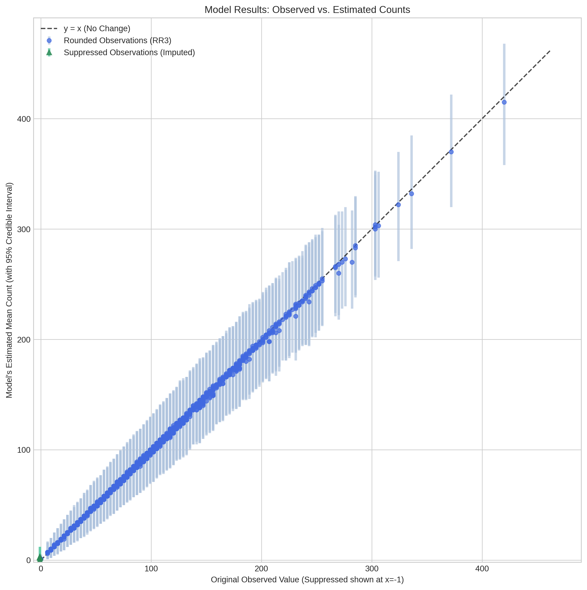

# Hierarchical Bayesian Model for Disaggregating Suppressed Census Data

## Overview

This project contains a sophisticated hierarchical Bayesian model designed to estimate the true, unsuppressed counts of household data at a low geographic level (SA2) by leveraging suppressed data from multiple geographic levels (SA2, TA, and National).

The primary challenge is that the input data has been confidentialised. This means some values are suppressed (hidden), and others have been modified through a process of Random Rounding to base 3 (RR3). The model is designed to account for both of these uncertainties.

## Methodology

The final model (`bayesian_model.py`) uses a hierarchical Gibbs sampler to generate posterior distributions for the true counts at each geographic level. This approach was chosen over a simpler deterministic optimization as it better captures the statistical nature of the problem and provides uncertainty estimates for the final counts.

The key features of the model are:

1.  **Hierarchical Structure**: The model respects the geographic hierarchy. The national total informs the distribution of counts across TAs, and each TA's total in turn informs the distribution of counts across its constituent SA2s.

2.  **Gibbs Sampling**: The model uses an iterative Gibbs sampler to explore the space of plausible solutions. Instead of finding a single "best" answer, it generates thousands of samples, the average of which is used as the final estimate.

3.  **Full Data Imputation**: The model does not take any observed value as ground truth. In each iteration of the sampler, it re-estimates the likely true values of the observed data:
    *   **For Suppressed Values**: The model knows these must be small integers. It imputes them by drawing samples from a **Truncated Poisson distribution** (constrained to be less than 6), informed by the model's current estimates.
    *   **For Rounded (RR3) Values**: The model knows the true value is close to the observed rounded value. It imputes a new "truer" value by sampling from a small, uniform range (`k-1`, `k`, `k+1`) around the observation.

This full imputation process allows the model to robustly account for the noise and missingness introduced by the confidentialization process.

## File Structure

```
.
├── bayesian_model.py       # Main script with the final hierarchical Bayesian model.
├── run_optimization.py     # Script for an earlier, deterministic optimization-based approach.
├── data/
│   ├── classifications/    # Mapping files (e.g., sa2_to_ta_map.csv).
│   ├── processed/          # Processed input data files.
│   │   ├── sa2_level_data.csv
│   │   ├── ta_level_data.csv
│   │   └── national_level_data.csv
│   └── outputs/            # Directory where all model outputs are saved.
│       ├── bayesian_samples/
│       │   └── ... (raw .npy sample files for each category)
│       └── bayesian_summaries/
│           └── ... (summary .csv files for each category)
└── README.md               # This file.
```

## How to Run the Model

### Dependencies

The script requires the following Python libraries:
*   `pandas`
*   `numpy`
*   `scipy`

You can install them via pip:
`pip install pandas numpy scipy`

### Execution

To run the full analysis, execute the main script from your terminal. The script will automatically discover all unique data categories, process them in a loop, and save the results.

```sh
python bayesian_model.py
```

**Note:** This is a computationally intensive process that will take a significant amount of time to run through all categories.

## Understanding the Output

The script will save two types of files for each category (e.g., `hh_1002_bed_01_...`) into the `data/outputs/` directory:

1.  **Summaries (`bayesian_summaries/` folder)**: A `.csv` file containing the final results. Key columns include:
    *   `OBS_VALUE`: The original, suppressed/rounded value.
    *   `estimated_count_mean`: The main estimate for the true count (the mean of the posterior samples).
    *   `ci_95_lower` & `ci_95_upper`: A 95% credible interval, providing a plausible range for the true count.

2.  **Raw Samples (`bayesian_samples/` folder)**: A `.npy` file containing the raw array of posterior samples from the Gibbs sampler. This can be loaded using `numpy.load()` for more detailed analysis, such as plotting the posterior distribution for a specific SA2.

## Results Visualization

The plot below shows a sample of the model's output for a single category. It compares the original observed values (x-axis) to the model's estimated mean counts (y-axis).

*   **Blue Circles** represent data that was rounded (RR3). The model often adjusts these values to satisfy the geographic constraints.
*   **Green Triangles** (at x=-1) represent data that was suppressed. The model imputes these values and provides an estimate with uncertainty.
*   **Error bars** show the 95% credible interval for each estimate, indicating the model's certainty.
*   The **dashed line** is the `y=x` line, where no change would have been made.

